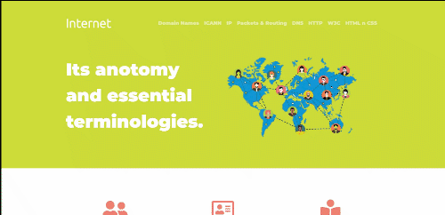

# IS601 - How Internet Works

A website about [How Internet Works](https://danishbread.github.io/601-How-Internet-Works-/).

Website URL: [https://danishbread.github.io/601-How-Internet-Works-/index.html](https://danishbread.github.io/601-How-Internet-Works-/index.html)

## Project contributers:

 - [Arpit Rai](https://github.com/DanishBread/)

## References

 - https://www.w3.org/Consortium/
 - https://itlaw.wikia.org/wiki/Packet_routing
 - https://docs.oracle.com/cd/E19120-01/open.solaris/819-3000/gcvjj/index.html
 - https://www.whatismyip.com/what-is-an-ip-address/
 - https://www.domaintools.com/support/what-is-icann-and-how-is-it-related-to-registries-and-registrars
 - https://www.extrahop.com/resources/protocols/http/
 - https://www.nginx.com/resources/glossary/http/
 - https://blog.hubspot.com/marketing/web-design-html-css-javascript
